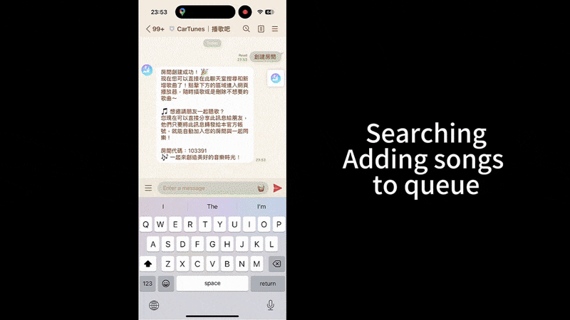

# CarTunes 🎵

<div align="center">

  

### Real-time Collaborative Music Queue for Road Trips / Parties

[](https://github.com/HappyGroupHub/CarTunes/releases)
[](https://github.com/HappyGroupHub/CarTunes/releases)
[](https://github.com/HappyGroupHub/CarTunes/blob/master/LICENSE)

  <h4>
    <a href="#english">English</a>
    ·
    <a href="#繁體中文">繁體中文</a>
  </h4>

### 🎉 Try it now! Add our [LINE Bot](https://line.me/R/ti/p/@987bvapz) 🎉

</div>

---

## English

## 🚗 What is CarTunes?

CarTunes is a real-time collaborative music queue system designed for road trips, parties, or any group listening
experience. Users can control playlists, add songs, and manage playback through a LINE bot and web interface - all
synchronized in real-time.

### ✨ Key Features

- **🤖 LINE Bot Integration** - Add songs by searching keywords or pasting YouTube links directly in LINE chat
- **🌐 Real-time Web Player** - Beautiful web interface with live updates for all users
- **🔄 Collaborative Queue** - Multiple users can add, remove, and reorder songs simultaneously
- **📱 Mobile-First Design** - Optimized for use on phones during road trips or parties
- **🎵 Smart Autoplay** - Automatically queues recommended songs when playlist ends
- **🏠 Room System** - Create private rooms with 6-character codes to share with friends



---

## 🚀 Quick Start - Start using the service

### Step 1: Add the LINE Bot

- [Click here](https://line.me/R/ti/p/@987bvapz) to add CarTunes Official Account to your LINE.

### Step 2: Create or Join a Room

- Tap on `創建房間` to create a new room or `加入房間` to join an existing one with the RichMenu
- Or directly forward a friend's room message to join instantly

### Step 3: Start Adding Songs!

- Search by typing song or artists names directly in chat
- YouTube links are also supported, just paste them in
- Use the rich menu buttons for quick controls like play/pause, skip, and more

### Step 4: Open the Web Player

- Click the `點擊進入網頁播放器` button in RichMenu to open the synchronized web player.
- You can reorder the queue, delete songs, or toggle autoplay from there.

---

## 💻 Self-Hosting Guide

### Prerequisites

- Python 3.8+
- Node.js 16+
- FFmpeg
- LINE Developer Account
- HTTPS domain (for LINE webhooks)

### Start your own server

1. **Clone the repository**

```bash
git clone https://github.com/HappyGroupHub/CarTunes.git
```

2. **Backend Hosting and Config**

```bash
cd CarTunes/backend

# ===== Setup python environment and install dependencies =====
# Windows
setup.bat
# Linux/Mac
python -m venv .venv
source .venv/bin/activate
pip install -r requirements.txt

# ===== Setup config file =====
# Windows
copy config.example.yml config.yml
# Linux/Mac
cp config.example.yml config.yml

# Before you run the backend server,
# Edit config.yml to set your LINE bot credentials and other settings

# ===== Run the backend (Finish config.yml first) =====
# Windows
run.bat
# Linux/Mac
python main.py
```

3. **Frontend Hosting and .ENV**

```bash
cd ../frontend
npm install
cp .env.example .env.local

# Before you run the frontend server,
# Edit .env.local to set your environment variables

npm run build
npm start
```

---

## ⚙️ Configuration Guide

### Setting up config.yml

The `config.yml` file contains all backend settings:

```yaml
# LINE Bot Credentials (Required)
line_channel_access_token: 'YOUR_CHANNEL_ACCESS_TOKEN'
line_channel_secret: 'YOUR_CHANNEL_SECRET'

# Server Ports
api_endpoints_port: 5000
line_webhook_port: 5001

# Frontend URL (for rich menu links)
frontend_url: 'https://your-domain.com'

# Audio Settings
song_start_delay_seconds: 1      # Delay before playback starts
song_length_limit: 1800          # Max song length (30 minutes)
audio_quality_kbps: 96           # Audio bitrate
max_cache_size_mb: 300           # Cache size limit
cache_duration_hours: 1          # How long to keep cached audio

# Room Settings  
numeric_room_code: false         # Use numbers-only room codes
pause_music_after_no_connections: 10  # Auto-pause delay
room_cleanup_after_inactivity: 120    # Room deletion timeout

# Autoplay Settings
autoplay_default: true           # Enable autoplay by default
autoplay_search_engine: 'youtube_music'  # or 'youtube'

# Localization (for search results)
hl_param: 'zh-TW'
gl_param: 'TW'

# Rate Limiting
action_throttle_seconds: 1
bring_to_top_throttle:
  max_requests: 2
  window_seconds: 5
line_message_throttle_seconds: 0.8
```

### Setting up .env.local

```env
NEXT_PUBLIC_API_BASE_URL=http://localhost:5000
NEXT_PUBLIC_WS_BASE_URL=ws://localhost:5000
NEXT_PUBLIC_LINE_BOT_URL=https://line.me/R/ti/p/@YOUR_LINE_BOT
```

Fill in your backend API URL in both `NEXT_PUBLIC_API_BASE_URL` and `NEXT_PUBLIC_WS_BASE_URL`.
Most of the time, it should be the same URL, just change `http(s)` to `ws(s)` for the WebSocket URL.
Place your LINE bot invite link in `NEXT_PUBLIC_LINE_BOT_URL`.

### How to get LINE channel access token and secret

1. Go to [LINE Developers](https://developers.line.biz/console/) and login with your LINE account
2. If you don't have a Business ID, simply create one by following the instructions
3. Then click `Create a new provider`
4. Fill in the required information and click `Create`
5. Click `Create a new channel` and select `Messaging API`
6. Fill in the required information and click `Create`
7. You can now find your channel secret in Basic settings and channel access token in Message API, click `Issue` to copy
   it

**Notes**: Please make sure you've **checked** `Allow bot to join group chats` option and **un-checked**
`Auto-reply messages` in your LINE bot settings, which can be found in `Messaging API` >
`LINE Official Account features` section.

### Setting up LINE webhook

1. Go to [LINE Developers](https://developers.line.biz/console/) and login with your LINE account
2. Select your channel application
3. Select Messaging API, find `Webhook URL` and click edit
4. Fill in your webhook URL and add `/callback` at the end
5. Click `Save` and it's pretty done!
6. Remember to check `Use webhook` under the `Webhook URL` section

**Notes**: LINE webhook only works with HTTPS, so you need to use a reverse proxy to make it work. If you don't know how
to create a reverse proxy, you can use [ngrok](https://ngrok.com/)
or [cloudflared](https://github.com/cloudflare/cloudflared) to create one easily.

---

## 🤝 Contributing

We welcome contributions! Please feel free to submit pull requests or open issues for bugs and feature requests.

## ⚠️ Disclaimer

This project is for educational and personal use only. Users are responsible for complying with all applicable laws and terms of service when using CarTunes. The developers are not liable for any misuse of this software or copyright infringement. Please respect intellectual property rights and use this software responsibly.

For full disclaimer, see [DISCLAIMER.md](DISCLAIMER.md).

## 📄 License

This project is licensed under the AGPL-3.0 License - see the [LICENSE](LICENSE) file for details.

---

# 繁體中文

## 🚗 什麼是 CarTunes？

CarTunes 是一個即時協作音樂播放系統，專為公路旅行、派對或任何團體聆聽體驗而設計。使用者可以透過 LINE 機器人和網頁介面控制播放清單、新增歌曲和管理播放 - 全部即時同步。

### ✨ 主要功能

- **🤖 LINE Bot 整合** - 透過搜尋關鍵字或直接貼上 YouTube 連結來新增歌曲
- **🌐 即時網頁播放器** - 美觀的網頁介面，所有使用者都能看到即時更新
- **🔄 協作播放清單** - 多位使用者可以同時新增、刪除和重新排序歌曲
- **📱 行動優先設計** - 針對旅途或派對中的手機使用進行最佳化
- **🎵 智慧自動播放** - 播放清單結束時自動加入推薦歌曲
- **🏠 房間系統** - 建立私人房間，使用 6 字元代碼與朋友分享


---

## 🚀 快速開始 - 開始使用服務

### 步驟 1：加入 LINE Bot

- [點擊這裡](https://line.me/R/ti/p/@987bvapz)將 CarTunes 官方帳號加入您的 LINE。

### 步驟 2：建立或加入房間

- 在 RichMenu 中點選 `創建房間` 來建立新房間，或點選 `加入房間` 來加入現有房間
- 或直接轉發朋友的房間訊息立即加入

### 步驟 3：開始新增歌曲！

- 直接在聊天室中輸入歌曲或歌手名稱來搜尋
- 也支援 YouTube 連結，直接貼上即可
- 使用 Rich Menu 按鈕快速控制播放/暫停、跳過等功能

### 步驟 4：開啟網頁播放器

- 點擊 RichMenu 中的 `點擊進入網頁播放器` 按鈕來開啟同步的網頁播放器
- 您可以在此重新排序播放清單、刪除歌曲或切換自動播放

---

## 💻 自行架設指南

### 前置需求

- Python 3.8+
- Node.js 16+
- FFmpeg
- LINE 開發者帳號
- HTTPS 網域（用於 LINE webhooks）

### 啟動您自己的伺服器

1. **複製儲存庫**

```bash
git clone https://github.com/HappyGroupHub/CarTunes.git
```

2. **後端架設與設定**

```bash
cd CarTunes/backend

# ===== 設定 Python 環境並安裝相依套件 =====
# Windows
setup.bat
# Linux/Mac
python -m venv .venv
source .venv/bin/activate
pip install -r requirements.txt

# ===== 設定 config 檔案 =====
# Windows
copy config.example.yml config.yml
# Linux/Mac
cp config.example.yml config.yml

# 在執行後端伺服器前
# 編輯 config.yml 來設定您的 LINE bot 憑證和其他設定

# ===== 執行後端（先完成 config.yml 設定）=====
# Windows
run.bat
# Linux/Mac
python main.py
```

3. **前端架設與 .ENV 設定**

```bash
cd ../frontend
npm install
cp .env.example .env.local

# 在執行前端伺服器前
# 編輯 .env.local 來設定您的環境變數

npm run build
npm start
```

---

## ⚙️ 設定指南

### 設定 config.yml

`config.yml` 檔案包含所有後端設定：

```yaml
# LINE Bot 憑證（必填）
line_channel_access_token: 'YOUR_CHANNEL_ACCESS_TOKEN'
line_channel_secret: 'YOUR_CHANNEL_SECRET'

# 伺服器連接埠
api_endpoints_port: 5000
line_webhook_port: 5001

# 前端網址（用於 Rich Menu 連結）
frontend_url: 'https://your-domain.com'

# 音訊設定
song_start_delay_seconds: 1      # 播放開始前的延遲
song_length_limit: 1800          # 最長歌曲長度（30 分鐘）
audio_quality_kbps: 96           # 音訊位元率
max_cache_size_mb: 300           # 快取大小限制
cache_duration_hours: 1          # 保留快取音訊的時間

# 房間設定
numeric_room_code: false         # 使用純數字房間代碼
pause_music_after_no_connections: 10  # 自動暫停延遲
room_cleanup_after_inactivity: 120    # 房間刪除逾時

# 自動播放設定
autoplay_default: true           # 預設啟用自動播放
autoplay_search_engine: 'youtube_music'  # 或 'youtube'

# 本地化（用於搜尋結果）
hl_param: 'zh-TW'
gl_param: 'TW'

# 速率限制
action_throttle_seconds: 1
bring_to_top_throttle:
  max_requests: 2
  window_seconds: 5
line_message_throttle_seconds: 0.8
```

### 設定 .env.local

```env
NEXT_PUBLIC_API_BASE_URL=http://localhost:5000
NEXT_PUBLIC_WS_BASE_URL=ws://localhost:5000
NEXT_PUBLIC_LINE_BOT_URL=https://line.me/R/ti/p/@YOUR_LINE_BOT
```

在 `NEXT_PUBLIC_API_BASE_URL` 和 `NEXT_PUBLIC_WS_BASE_URL` 中填入您的後端 API URL。
大多數情況下應該是相同的 URL，只需將 `http(s)` 改為 `ws(s)` 用於 WebSocket URL。
在 `NEXT_PUBLIC_LINE_BOT_URL` 中放置您的 LINE bot 邀請連結。

### 如何取得 LINE channel access token 和 secret

1. 前往 [LINE Developers](https://developers.line.biz/console/) 並使用您的 LINE 帳號登入
2. 如果您沒有 Business ID，只需按照說明建立一個
3. 然後點擊 `Create a new provider`
4. 填寫必要資訊並點擊 `Create`
5. 點擊 `Create a new channel` 並選擇 `Messaging API`
6. 填寫必要資訊並點擊 `Create`
7. 現在您可以在 Basic settings 中找到 channel secret，在 Messaging API 中找到 channel access token，點擊 `Issue` 來複製

**注意事項**：請確保您已經**勾選**了 `Allow bot to join group chats` 選項，並**取消勾選**
`Auto-reply messages`，這些設定可以在 `Messaging API` > `LINE Official Account features` 部分找到。

### 設定 LINE webhook

1. 前往 [LINE Developers](https://developers.line.biz/console/) 並使用您的 LINE 帳號登入
2. 選擇您的頻道應用程式
3. 選擇 Messaging API，找到 `Webhook URL` 並點擊編輯
4. 填入您的 webhook URL 並在結尾加上 `/callback`
5. 點擊 `Save` 就完成了！
6. 記得在 `Webhook URL` 部分下方勾選 `Use webhook`

**注意事項**：LINE webhook 只能使用 HTTPS，所以您需要使用反向代理來讓它運作。如果您不知道如何建立反向代理，
可以使用 [ngrok](https://ngrok.com/) 或 [cloudflared](https://github.com/cloudflare/cloudflared) 輕鬆建立。

---

## 🤝 貢獻

我們歡迎貢獻！請隨時提交 pull request 或為錯誤和功能請求開啟 issues。

## ⚠️ 免責聲明

本專案僅供教育和個人使用。使用 CarTunes 時，使用者需自行負責遵守所有適用的法律和服務條款。開發者對於本軟體的任何濫用或版權侵權行為概不負責。請尊重智慧財產權並負責任地使用本軟體。

完整免責聲明請參閱 [DISCLAIMER.md](DISCLAIMER.md)。

## 📄 授權

本專案採用 AGPL-3.0 授權 - 詳細資訊請參閱 [LICENSE](LICENSE) 檔案。
